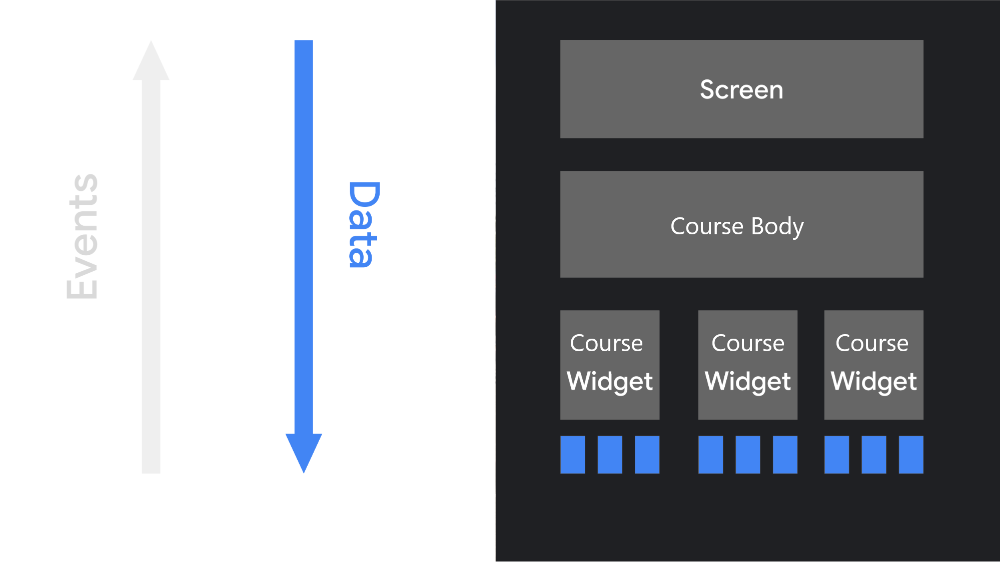
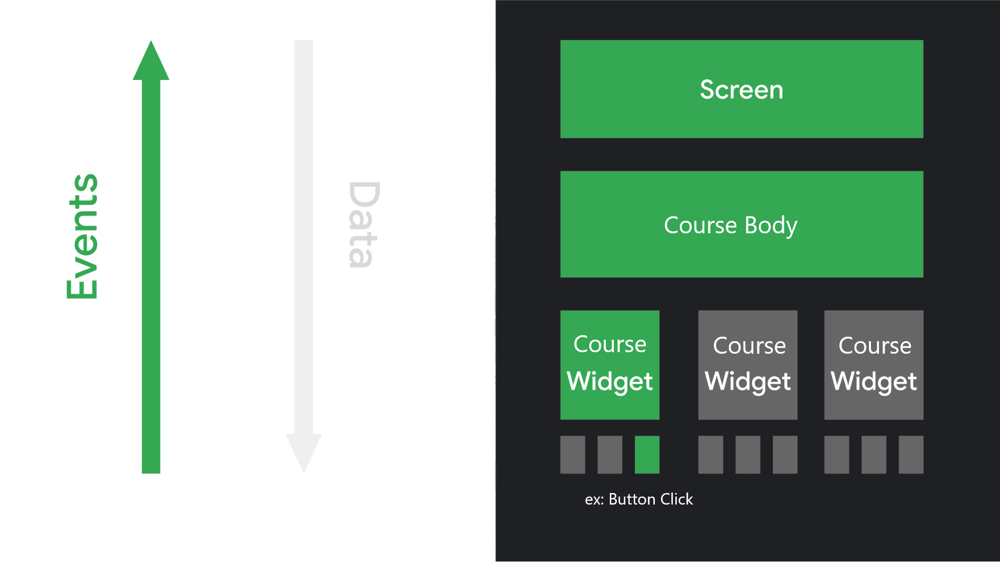

請使用 Kotlin 實作一個 app 首頁課程列表畫面，並寫文件或註解來解釋你的設計考量。除了指定需求外，你可以自由設計 model 和 UI 來提供更好的體驗。

## 技術規定
- Deployment Target 為 Android 12。
- 可使用第三方 library。
- 請寫文件或註解來解釋你的設計考量。

## 需求
請實作一個在 app 首頁看到的課程列表，需求如下：

#### 資料
- 請設計一個的 Data Loader 的抽象層來提供課程資料。
- 請用專案中提供的 json file 實作上述 Data Loader 的一個實例。

#### UI 設計
- 依照課程當前狀態，顯示不同的標籤
- 課程標題至多兩行
- 本題目不用在意卡片尺寸、顏色、間距等細節，請將重點放在如何排版。（你仍然可以盡量符合示意圖）

## 提交

- 請下載或 fork Hahow Android Engineer 面試題目初始專案。
- 請將成果上傳至 GitHub 並直接提供 repo 連結。

----------

## UI
* [Jetpack Compose](https://developer.android.com/jetpack/compose) - Build declarative and reusable UI with Kotlin
* [Material 3](https://m3.material.io/) - Google’s design system for UI components, color, font style, and shapes
  
## Libraries
- [Timber](https://github.com/JakeWharton/timber) - Logger with a small, extensible API
- [Dagger-Hilt](https://developer.android.com/training/dependency-injection/hilt-android) - Implement dependency injection
- [Coil](https://github.com/coil-kt/coil) - Image loading for Android backed by Kotlin Coroutines
- [Gson](https://github.com/google/gson) - A Java serialization/deserialization library to convert Java Objects into JSON and back
- [ThreeTenABP:](https://github.com/JakeWharton/ThreeTenABP) - Backport the modern Java 8 java.time API (JSR-310) for older Android devices

## Architecture & Design Patterns
### UI layer
- **ViewModel**: Fetch data from higher layers, update UI State(StateFlow) and handle UI events
- **Composeable Screen**: Collect UI state from ViewModel as an immutable state, then pass it down to composable widgets for displaying the UI. Invoke ViewModel's function when a UI event occurs

### Domain layer
- **Domain Model**: Data classes that are representing real-world concepts for the user
- **Repository Interface**: Define a contract for data access and provide methods for retrieving

### Data layer
- **RepositoryImpl**: Implement the repository interface methods from domain layer
- **DTO Model**: Data classes that hold data retrieved from the data source
- **MockAssetManager**: Provide fake JSON data

### UDF(Unidirectional Data Flow) pattern
- An one-way data flow pattern where data flows down and events flow up
  
   
